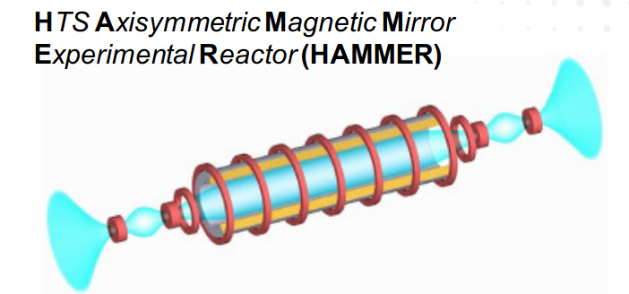

# HTS-Tandem

<!-- PROJECT LOGO -->
 

  

  <h3 align="center">HTS Axisymmetric Tandem Mirror Design</h3>

  

    A cheaper approach to near-term fusion energy
  

<!-- TABLE OF CONTENTS -->

  
Table of Contents

  <ol>
    <li>
      <a href="#about-the-project">About The Project</a>
      <ul>
        <li><a href="#goals">Goals</a></li>
      </ul>
    </li>
    <li>
      <a href="#getting-started">Getting Started</a>
      <ul>
        <li><a href="#prerequisites">Prerequisites</a></li>
        <li><a href="#installation">Installation</a></li>
      </ul>
    </li>
    <li><a href="#usage">Usage</a></li>
    <li><a href="#roadmap">Roadmap</a></li>
    <li><a href="#contributing">Contributing</a></li>
    <li><a href="#license">License</a></li>
    <li><a href="#contact">Contact</a></li>
    <li><a href="#acknowledgements">Acknowledgements</a></li>
  </ol>

<!-- ABOUT THE PROJECT -->
## About The Project

Placeholder

### Goals

Placeholder

<!-- GETTING STARTED -->
## Getting Started

Placeholder

### Prerequisites

Placeholder

### Installation

Placeholder

<!-- EXAMPLES -->
## Usage

Placeholder

<!-- ROADMAP -->
## Roadmap

Placeholder

<!-- CONTRIBUTING -->
## Contributing

Placeholder

<!-- LICENSE -->
## License

Not for distribution

<!-- CONTACT -->
## Contact

Placeholder

<!-- ACKNOWLEDGEMENTS -->
## Acknowledgements
Placeholder

